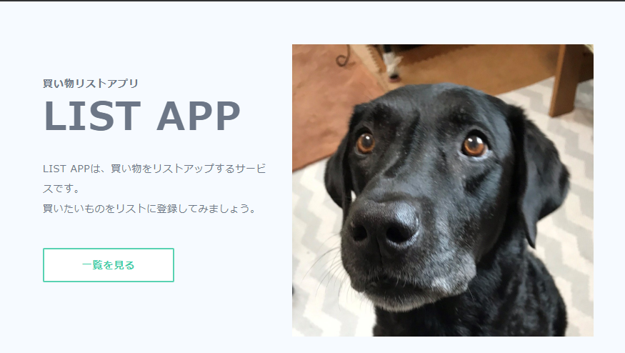
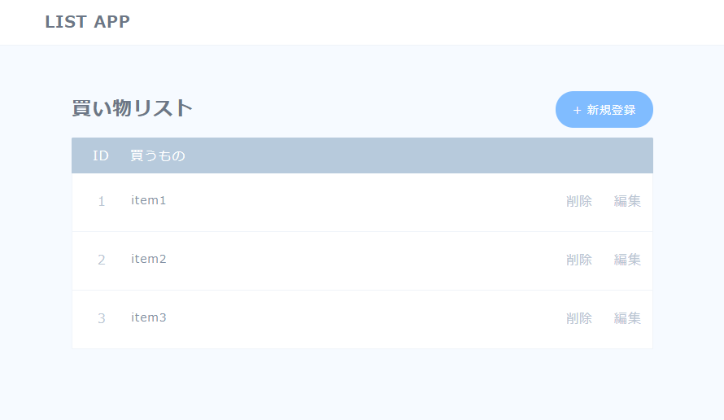

# nodejs_progate

This is Progate Node.js sample repository.
This application provides simple function about shopping list.
And as a premise, this application is supposed to connect with MySQL.

# Demo




# Table of Contents

* [Requirement](#requirement)
* [SetUp](#setUp)
* [Usage](#usage)
* [Note](#note)

## Requirement

* Node.js
* MySQL

## SetUp

Execute the following sql to own MySQL.
Please change the enviromental information etc. as appropriate.
For example, database name, user name, password, etc.

[Set up sql](./setup/db/setup.sql)

## Usage

```bash
git clone https://github.com/kbanchi1111/nodejs_sample.git
cd nodejs_sample/app
node app.js
```

Please change the enviromental information etc. as appropriate.
For example, database name, user name, password, etc.

Then access URL above.

http://localhost:3000/

## Note